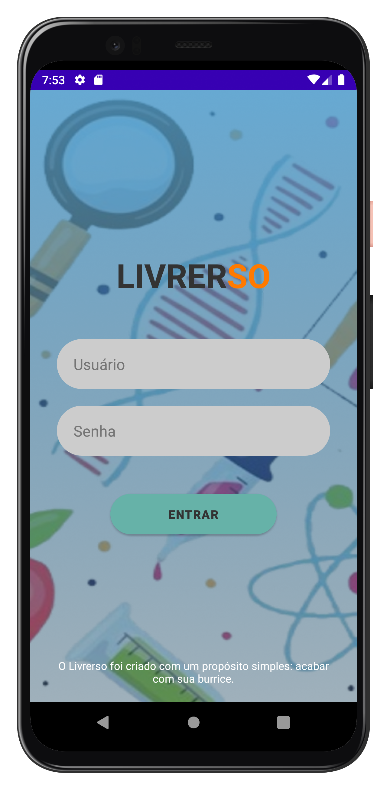
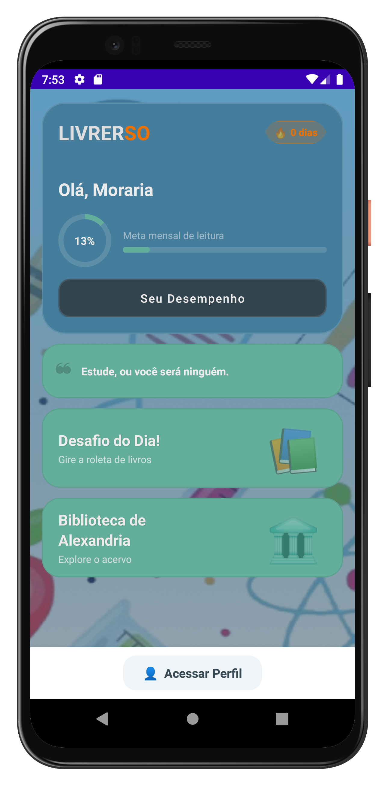
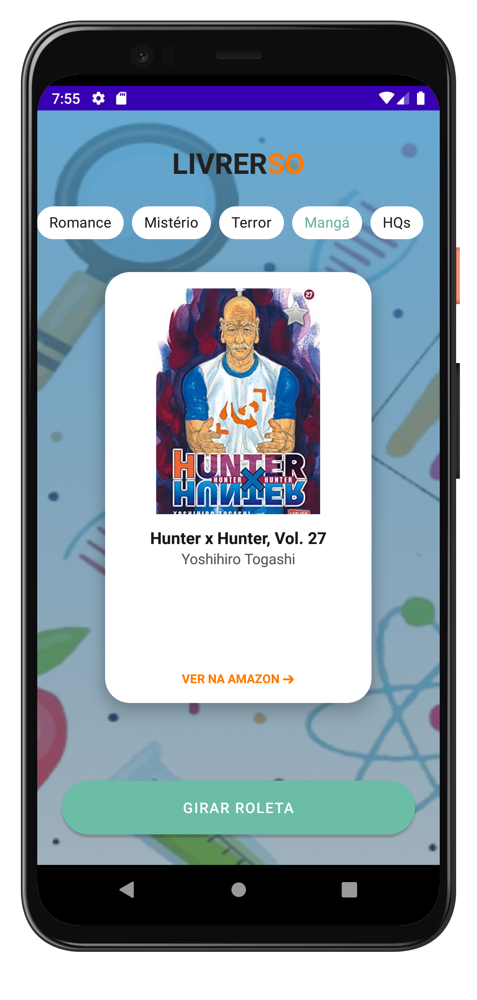
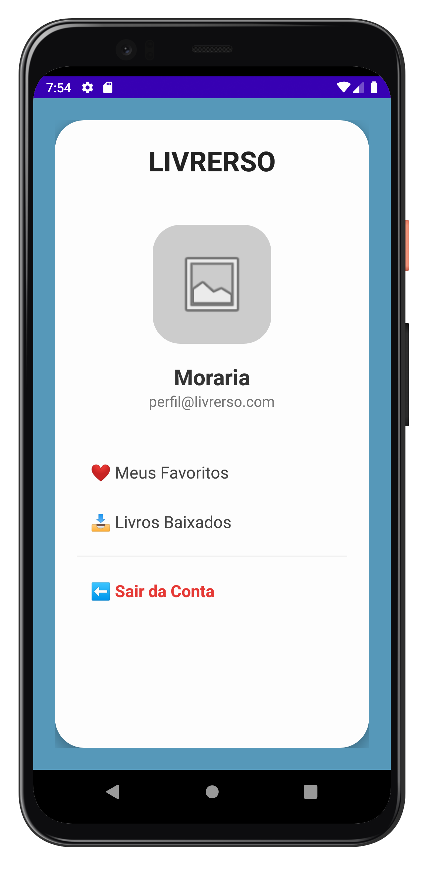
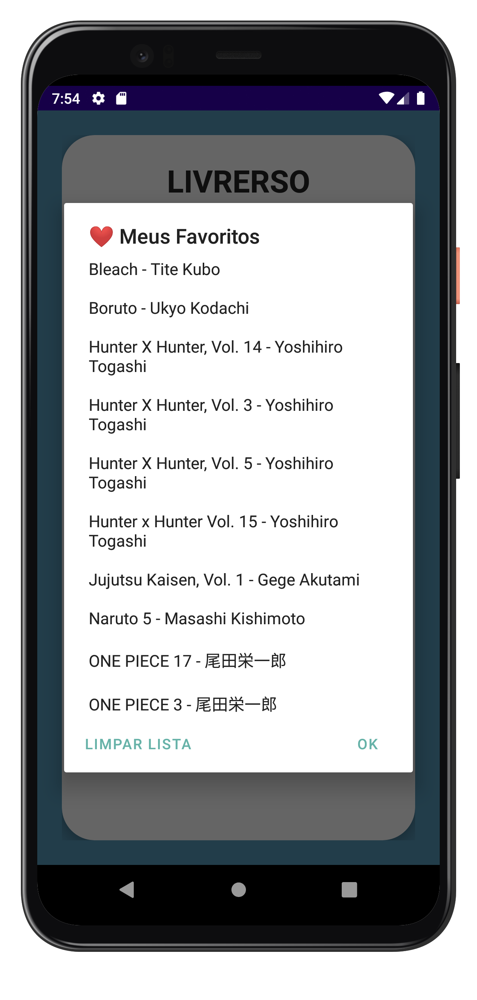

# Livrerso 📚

*Acabe com sua "burrice" através da leitura.*

  

## 🚀 Sobre o Projeto

O **Livrerso** é um assistente de leitura gamificado que ajuda você a encontrar seu próximo livro favorito. Com uma interface pensada para ser rápida e prazerosa, o app combina curadoria de acervo com uma mecânica divertida de roleta.

---

## 📱 Fluxo do Usuário

### 1. Autenticação e Entrada

*Aqui o usuário inicia sua jornada.*

| Tela de Login | Home Screen |
| :---: | :---: |
|  |  |

### 2. A Experiência de Descoberta

*A "Roleta" é o diferencial do Livrerso: uma slot machine de livros que sorteia sem repetir, com capa, título e autor vindos direto da API do Open Library — e uma melodia própria quando o resultado sai.*

  

  
   
  Roleta em ação (23s)

### 3. Gestão e Perfil

*Mantenha o controle da sua jornada literária.*

| Menu de Perfil | Lista de Favoritos |
| :---: | :---: |
|  |  |

---

## 🛠 Stack Técnica

- **Base**: Kotlin + Activities/XML (`AppCompatActivity`), sem framework de arquitetura adicional — foco em simplicidade e entrega rápida do MVP.
- **UI**: `Material Components` (cards, chips, botões) e animações com `ObjectAnimator`, `AnimatorSet` e `OvershootInterpolator` para dar vida à seleção da roleta.
- **Rede**: `OkHttp` para chamadas assíncronas à API do Open Library, com fallback local de livros caso a requisição falhe ou não haja resultados.
- **Imagens**: `Glide` para carregamento e cache das capas.
- **Diferencial**: síntese de áudio via `AudioTrack` — a melodia de acerto é gerada em tempo real com ondas senoidais, sem nenhum arquivo de som embutido.

## 📈 Roadmap de Evolução

- [ ] Implementação de leitura de e-books offline.
- [ ] Sistema de conquistas baseado em tempo de leitura.
- [ ] Integração com redes sociais para compartilhar o "Livro do Dia".
- [ ] Migração para arquitetura MVVM com ViewModel/LiveData.

---

*Desenvolvido por Morária.*
